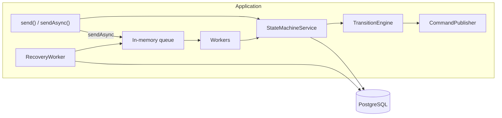

# spring-boot-state-machine-starter

[](https://github.com/KHolodilin/spring-boot-state-machine-starter/actions/workflows/ci.yml)
[](https://codecov.io/gh/KHolodilin/spring-boot-state-machine-starter)
[](https://central.sonatype.com/artifact/com.kholodilin/state-machine-spring-boot-starter)
[](https://openjdk.org/projects/jdk/21/)
[](https://spring.io/projects/spring-boot)
[](LICENSE)

Lightweight persistent state machine for Spring Boot with PostgreSQL durability, synchronous and asynchronous events, in-memory hot state cache, event idempotency and command-based workflow orchestration.

## Why this project

Spring applications often need durable workflows (order fulfillment, onboarding, compensation) without a full BPM engine. This starter answers:

- Where is the process now?
- What happened?
- Is the transition allowed?
- Where to go next?
- What must happen after the transition?

It is **not** BPMN, not a UI, and not a Kafka/REST framework. Core stays independent of those transports.

## Core concepts

| Concept | Role |
|---|---|
| `StateMachineDefinition` | Static states, events, guards, commands |
| `StateMachineInstance` | One running machine (`machineType` + `machineId`) |
| `StateMachineEvent` | Incoming fact with globally unique `eventId` |
| `Guard` | Pure predicate for a transition |
| `Command` | Intent after a successful transition |
| `Context` | Small workflow-only JSON (`reservationId`, retry counters) |

Formula:

```text
CURRENT STATE + EVENT + optional GUARD
        -> NEW STATE
        + optional context update
        + 0..N COMMANDS
```

## Architecture

PostgreSQL is the durable source of truth. RAM is a cache. `eventId` is the idempotency key. Commands describe *what* should happen next; Outbox (optional, your adapter) describes *how* to deliver it.



`send()` takes an advisory lock, checks `eventId`, runs the engine and persists instance + event + commands in one JDBC transaction.

`sendAsync()` first inserts `state_machine_request`, then a partitioned in-memory queue and workers process it. Recovery re-offers durable requests if the queue was lost.

## Quick Start

Maven:

```xml
<dependency>
    <groupId>com.kholodilin</groupId>
    <artifactId>state-machine-spring-boot-starter</artifactId>
    <version>0.1.2</version>
</dependency>
```

Requires Java 21, Spring Boot 4.1, PostgreSQL.

```yaml
state-machine:
  persistence:
    schema:
      mode: create   # demo/test. Production: validate or none
```

Register a `StateMachineDefinition` bean. Inject `StateMachineService`.

## Defining a State Machine

Payload classes **must** be registered (needed for `sendAsync()` deserialization). Typed payload lambdas use `.event(event, Payload.class)`.

```java
@Bean
StateMachineDefinition<OrderState, OrderEvent> orderSaga() {
    return StateMachineDefinition
            .builder("order-saga", OrderState.class, OrderEvent.class)
            .initial(OrderState.NEW)
            .payload(OrderEvent.START, Void.class)
            .payload(OrderEvent.PAYMENT_RESERVED, PaymentReservedPayload.class)
            .transition()
                .from(OrderState.NEW)
                .event(OrderEvent.START)
                .to(OrderState.PAYMENT_PENDING)
                .command(ctx -> new ReservePaymentCommand(ctx.machineId()))
            .transition()
                .from(OrderState.PAYMENT_PENDING)
                .event(OrderEvent.PAYMENT_RESERVED, PaymentReservedPayload.class)
                .to(OrderState.INVENTORY_PENDING)
                .updateContext((ctx, event) ->
                        ctx.put("paymentReservationId", event.payload().reservationId()))
                .command(ctx -> new ReserveInventoryCommand(
                        ctx.machineId(),
                        ctx.workflowContext().getString("paymentReservationId").orElseThrow()))
            .build();
}
```

Duplicate `machineType` beans fail startup. Guards and command factories must be **pure** (no I/O): they run inside the state transition transaction.

## `send()` vs `sendAsync()`

`send()` runs the transition on the caller thread and returns `TransitionResult`:

- `Success` — state changed, `0..N` commands published
- `Duplicate` — this `eventId` was already processed (not an error)
- `Rejected` — no matching transition / all guards false

Infrastructure failures throw (`OptimisticLockConflictException`, persistence errors, ambiguous transitions).

`sendAsync()` durably inserts the event into `state_machine_request` and returns `AsyncSubmission` after commit. Workers process it later. Overflow of the in-memory queue does **not** lose the request: recovery re-offers it.

Do not use `machineId + eventType` as an idempotency key. The same event type can legally occur more than once; `eventId` must be globally unique (UUID recommended).

## Events and idempotency

Rejected events are written to `state_machine_event` with `result = rejected` and `from_state = to_state`. A later send of the same `eventId` returns `Duplicate`, even if you later change the definition.

## Commands

A command is an intent, not a transport. Default publisher logs commands (`LoggingCommandPublisher`). Replace the `StateMachineCommandPublisher` bean with a transactional Outbox adapter so that:

```text
UPDATE instance + INSERT event + INSERT outbox rows
```

commit in **one JDBC transaction** on the same `DataSource`. Do not call Kafka/REST inside the publisher if you need atomicity.

## PostgreSQL persistence

Tables: `state_machine_instance`, `state_machine_event`, `state_machine_request`.

Optimistic locking:

```sql
UPDATE state_machine_instance ... WHERE version = ?
```

Concurrent processing of one instance is also serialized with `pg_advisory_xact_lock`. Cross-pod FIFO is not guaranteed; lost updates are.

Production schema: copy [docs/state-machine-schema.sql](docs/state-machine-schema.sql) into Flyway/Liquibase and set:

```yaml
state-machine:
  persistence:
    schema:
      mode: none
```

Modes: `create` (missing tables), `validate` (fail-fast), `none`.

## Cache

Caffeine hot set (`max-size`, `expire-after-access`). A cache hit still uses `UPDATE ... WHERE version = ?`. On conflict the entry is invalidated. Eviction does not write to the database.

## Async workers

Events for one `machineId` are hashed onto one in-memory partition (one platform thread per partition). Workers must not block on remote calls; emit commands instead.

## Recovery

A scheduled recovery job selects `NEW`, `FAILED`, and expired `PROCESSING` leases and offers them back to the normal worker pipeline. It does not run the engine itself.

## Schema management

See persistence above. `validate` checks tables, required columns, primary/unique keys, `result` check, and the recovery index.

## Metrics and tracing

Micrometer metrics include transition counters/timers, async counters, cache hit/miss, queue pressure, optimistic lock conflicts, and a periodic `state_machine_state_count` gauge. **Do not** use `machineId` or `eventId` as metric tags.

Each transition creates span `state-machine.transition`. `machineId` / `eventId` are allowed as trace attributes.

Actuator health indicator `stateMachine` reports cache/queue size and oldest pending request age. Queue overflow is not `DOWN` by itself.

Structured logs include `machineType`, `machineId`, `eventId`, `eventType`, `fromState`, `toState`, `result`, `duration`.

## Integration with Outbox

This repository does not depend on `spring-boot-outbox-starter`. Provide a `StateMachineCommandPublisher` that appends outbox rows in the current transaction. That is the recommended path for distributed saga command delivery.

## Saga example

Happy path:

```text
START -> PAYMENT_PENDING -> PAYMENT_RESERVED -> INVENTORY_PENDING
      -> INVENTORY_RESERVED -> COMPLETED
```

Failure:

```text
INVENTORY_REJECTED -> PAYMENT_COMPENSATION_PENDING
                   -> PAYMENT_RELEASED -> CANCELLED
```

Compensation is part of the application definition; the framework never infers it.

A full Kafka saga reference project is a **next milestone**. The `state-machine-demo` module shows the order-saga definition in-process.

Timeouts are ordinary events produced by your scheduler (`PAYMENT_TIMEOUT`). There is no built-in timer engine in v1.

## Requirements

- Java 21+
- Spring Boot 4.1.x
- PostgreSQL
- Maven

Build:

```bash
mvn verify
```

Demo (PostgreSQL via Docker):

```bash
docker compose -f state-machine-demo/docker-compose.yml up -d
mvn -pl state-machine-demo -am spring-boot:run
```

## License

Apache License 2.0. See [LICENSE](LICENSE).
